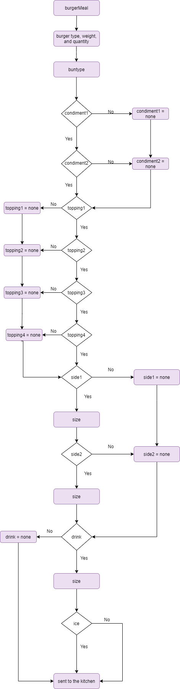

# ACME APP API 

## Inroduction

This API is for General Putnam Motel Diner. The API is for ordering takeout from the diner.
For this POC it will only show the meal lunch and the order of a burger meal.
In the future breakfast, dinner, and their corresponding dishes will be added.
This API is already set up to be used for in-house orders. Below you will see a work flow chart of the API.

[link to Post/lunch](https://github.com/TaliaNovich/Hamburger_API_Docs/blob/main/POST.md)

[link to Get/tableNo](https://github.com/TaliaNovich/Hamburger_API_Docs/blob/main/GET.md)

[link to Response codes](https://github.com/TaliaNovich/Hamburger_API_Docs/blob/main/Response_Codes.md)
